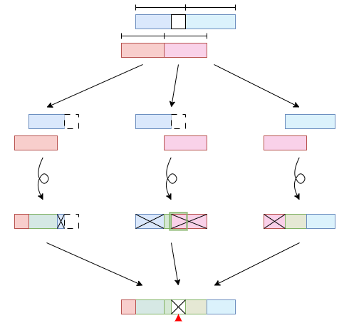

# merge-parallel

Attempt to come up with a merge function for merge-sort with very good work and
span bounds, without looking at Google.

## Preamble

Following what is typical to divide-and-conquer, if the input is one sequence,
we divide it into two halves, process the two halves, then recombine it.

Naturally, if we have two sequences, we might want to do something similar:

However, consider the sequences $\langle 1,3,4,8 \rangle$ and $\langle 2,5,6,7
\rangle$; the above algorithm would tell us to $\mathrm{merge}\left(
\left\langle 1,3\right\rangle,\left\langle 2,5\right\rangle\right)$ and
$\mathrm{merge}\left( \left\langle 4,8\right\rangle,\left\langle
6,7\right\rangle\right)$, then concatenate the result. We concatenate
$\left\langle 1,2,3,5\right\rangle$ to $\left\langle 4,6,7,8\right\rangle$ and
get $\left\langle 1,2,3,{\color{red}5},{\color{red}4},6,7,8\right\rangle$.

In general, something like *this* may happen (in diagram, seq representations
are aligned by value, not element number):

## Attempt 1: clean split

As the section title suggests, we try to avoid the above scenario by always
making clean splits that we know in advance would be safe for concatenation. We
pick one sequence and split it by number of elements (i.e. at its median), then
split the other sequence by *value* at the median we just computed.

The problem with this approach is that it takes time to find the position of a
*value* in a sorted sequence. To be exact, we can do this in $O(\lg\left\lvert
s\right\rvert)$ by using binary search, or in the same span if we prefer to
partition the sequence directly with $\mathrm{filter}$ (albeit incurring
$O(\left\lvert s\right\rvert)$ work). Since at each level of recursion we can
alternatingly split on the medians of either sequences, ensuring that its size
is cut in half, we can achieve logarithmic levels of recursion. But still, the
overall span would be $O\left( \lg^2 \left( \left\lvert s\right\rvert +
\left\lvert t\right\rvert\right)\right)$.

## Attempt 2: repair the middle afterwards

If the middle gets messed up, we can just do merge once more!

The problem is, how do we know this will end at all??

(We also cannot directly check the length of the overlapping middle, because
that will require looking up index by value, which is again binary search and
alone creates a span of $O(\lg \left\lvert s\right\rvert)$.)

Here's a clever observation: the length of the "middle" in the above blue
sequence is upperbounded by the length of its left half; the length of the
"middle" of the red sequence is upperbounded by that of its right half. This
means that when we do the repair, we can do it on a small region with at most
half the size, then splice the result back into our answer.

This gives the following recurrence for the span:

$$
\mathcal S\left( \left\lvert s\right\rvert,\left\lvert t\right\rvert\right) =
2\mathcal S\left( \left\lvert s\right\rvert / 2,\left\lvert t\right\rvert /
2\right) + O(1)
$$

Unfortunately, this solves to $\mathcal S\left( \left\lvert
s\right\rvert,\left\lvert t\right\rvert\right)=O\left( \left\lvert
s\right\rvert+\left\lvert t\right\rvert\right)$. However, this is a great
start! We have eliminated the dependency on binary search.

## Attempt 3: repair the middle as we go

Rather than saying the middle gets "messed up", we might as well say it hasn't
been affected at all, since it is the overhang that is for sure greater than
the max or less than the min of the other half-sequence. For this reason, we
might as well (following our diagrams) perform the repair early by merging the
left half of the blue sequence and the right half of the red sequence.

This gives the following recurrence for span:

$$
\mathcal S\left( \left\lvert s\right\rvert,\left\lvert t\right\rvert\right) =
\mathcal S\left( \left\lvert s\right\rvert / 2,\left\lvert t\right\rvert /
2\right) + O(1)
$$

which solves to $\mathcal S\left( \left\lvert s\right\rvert,\left\lvert
t\right\rvert\right)=O\left( \lg\left( \left\lvert s\right\rvert+\left\lvert
t\right\rvert\right)\right)$.

The remaining problem here is work, which is given by *this* recurrence
instead:

$$
\mathcal W\left( \left\lvert s\right\rvert,\left\lvert t\right\rvert\right) =
3\mathcal W\left( \left\lvert s\right\rvert / 2,\left\lvert t\right\rvert /
2\right) + O(1)
$$

which solves to $\mathcal W\left( \left\lvert s\right\rvert,\left\lvert
t\right\rvert\right)=O\left( \left( \left\lvert s\right\rvert+\left\lvert
t\right\rvert\right)^{\lg3}\right)$. Ideally, we don't want to do more work
than a linear merge. This is a real bummer. However, I can give you some
intuitions as to why $O\left( \left( \ldots\right)^{\lg3}\right)$ should be a
very loose bound. (I don't have a proof yet for a better bound.)

[How do I know where to split the
chunks?](#how-do-i-know-where-to-split-the-chunks)

### Edge cases and base cases

What we have done in [Attempt 2](#attempt-2) and [Attempt 3](#attempt-3)
assumes that the median of $s$ is between the min and max of $t$, and the
median of $t$ is between the min and max of $s$. What do we do when this is not
the case?

It's actually simpler, because if you see an entire half of a sequence not
overlapping with the other sequence by value, you can make it skip the process,
like so:

It only gets simpler when the two sequences *themselves* don't touch at all.

If one sequence is empty, then why bother!

(please do handle the empty case
first, as one of the sequences will not have a median, which is required for
many other cases).

### How do I know where to split the chunks

Binary search is *not* an option, but we can let the recursion return and
maintain the indices of sequence ends that get "hidden". This is the intuition
I start with. And indeed, the "hidden" ends are easy to obtain from the base
cases; they're also simple to maintain.

There are, however, two concerns: [leakage](#leakage) and [ownership
switch](#ownership-switch). Both follow from the fact that real sequences have
"gaps" in between adjacent values.

#### Leakage

I can think of no super elegant way to prevent this. I *could* in theory add
guard values or something, or I could just duplicate the pivot value, and
discard the duplicated copy later.

#### Ownership switch

(Actually, I only realized this when debugging.)

Ownership switch is a more extreme form of leakage; it happened to me because I
was stingy and wouldn't duplicate a pivot that isn't used in concatenation.

Long "gaps" can unexpectedly change the source (owner) of the parts of the
sequence coming before the first or after the second "hidden" end. The splice
step must assume that these parts have a certain owner, in order to discard the
correct parts. But since it clearly expects a certain owner, if we have tracked
the owner of the edge parts, and it is not the expected owner, then we can
update the "hidden" end so that this part is treated as part of the middle, and
the new edge part is empty and with the expected owner.

Alternatively, just duplicate the pivot again (which I didn't do, oops).

### Avoiding memory copy (append) in implementation

The naive way of collecting the result is to append the sequences (or flatten,
which is a bit better when there are more than two sequences to append
together). This, however, incurs a cost of copying memory, since each sequence
(at least according to our definition) occupies a contiguous segment of RAM. It
is also obviously not efficient to copy
[overhangs](#edge-cases-and-base-cases) that have been skipped.

From that latter observation, we might want to represent whole slices as a
single thing. I'm calling that thing a *fragment*. Intuitively, we should
change our return type to a sequence of fragments. However, this is still
problematic in two ways: (1) the fragment sequence itself can grow, and (2)
what if the "hidden" ends get caught in the middle of a fragment and become
impossible to index?

The second problem is a non-problem, because a "hidden" end comes from the end
of an actual sequence, and thus must be at the end of a fragment.

The first problem *is* a real problem. So what if we periodically combine the
fragment sequences by reference, not copying memory, into larger sequences? But
hang on, we don't want to deal with indeterminate *length* and *depth* at the
same time, and recursive types can't be constructed from supplying a type
parameter to a non-recursive generic type.

I'll spoil it. Use a tree.

---

---

Side note: idk (as I'm currently taking the course) if CMU 15-210 will teach us
not to use `Seq.flatten` to recursively flatten a tree into its inorder
traversal. That's wasted memory copy. You should generate size hints at each
level, preallocate a contiguous chunk of mutable memory (e.g. `'a option ref
Seq.t` initialized to `NONE`), track offsets as you recursively and
concurrently go down each chain in the tree, and write to the correct index in
the destination memory once you're at a leaf.

As a final note,

### Somebody please help me with the analysis of work bounds.
